# 1. خريطة الموقع (Sitemap) وقائمة الصفحات

> المرحلة الحالية: **تصميم UI/UX فقط** — لا يوجد Backend أو قاعدة بيانات أو مصادقة حقيقية. جميع البيانات تجريبية (Mock) من `src/data/mock.ts`.

## 1.1 Sitemap

```mermaid
flowchart TD
    ROOT(("المنصة"))

    ROOT --> PUB["الواجهة العامة"]
    PUB --> P1["/ الرئيسية"]
    PUB --> P2["/track متابعة بلاغ"]
    PUB --> P3["/screens فهرس الشاشات"]
    PUB --> P4["/design-system نظام التصميم"]

    ROOT --> AUTH["المصادقة"]
    AUTH --> A1["/login تسجيل الدخول"]
    AUTH --> A2["/register إنشاء حساب"]
    AUTH --> A3["/forgot-password نسيت كلمة المرور"]
    AUTH --> A4["/reset-password إعادة التعيين"]

    ROOT --> CIT["المواطن /citizen"]
    CIT --> C1["لوحتي"]
    CIT --> C2["بلاغاتي"]
    C2 --> C3["تفاصيل البلاغ"]
    C3 --> C4["تقييم الخدمة"]
    CIT --> C5["إنشاء بلاغ (4 خطوات)"]
    CIT --> C6["الإشعارات"]
    CIT --> C7["حسابي"]

    ROOT --> EMP["الموظف /employee"]
    EMP --> E1["لوحة التحكم"]
    EMP --> E2["جدول البلاغات"]
    E2 --> E3["تفاصيل البلاغ + الإجراءات"]
    EMP --> E4["خريطة البلاغات"]

    ROOT --> ADM["المدير /admin"]
    ADM --> D1["الرئيسية (KPIs + Charts)"]
    ADM --> D2["جميع البلاغات"]
    ADM --> AN["التحليل والذكاء"]
    AN --> D3["خريطة البلاغات + المناطق الساخنة"]
    AN --> D4["المشاكل المتكررة"]
    AN --> D5["الاستعداد للحالات الجوية"]
    AN --> D6["التقارير الشهرية"]
    AN --> D7["رضا المواطنين"]
    ADM --> SYS["إدارة النظام"]
    SYS --> S1["المستخدمون"]
    SYS --> S2["الموظفون"]
    SYS --> S3["الأقسام"]
    SYS --> S4["أنواع المشاكل"]
    SYS --> S5["المناطق"]
    SYS --> S6["الكلمات المفتاحية"]
    SYS --> S7["إعدادات النظام"]
```

## 1.2 قائمة جميع الصفحات (34 شاشة)

| # | الدور | الصفحة | المسار | الملف |
|---|---|---|---|---|
| 1 | عام | الصفحة الرئيسية | `/` | `pages/public/Home.tsx` |
| 2 | عام | متابعة بلاغ برقم المتابعة | `/track` | `pages/public/Track.tsx` |
| 3 | عام | فهرس الشاشات | `/screens` | `pages/public/Screens.tsx` |
| 4 | عام | نظام التصميم | `/design-system` | `pages/public/DesignSystem.tsx` |
| 5 | مصادقة | تسجيل الدخول | `/login` | `pages/auth/Login.tsx` |
| 6 | مصادقة | إنشاء حساب | `/register` | `pages/auth/Register.tsx` |
| 7 | مصادقة | نسيت كلمة المرور (+ شاشة "تحقق من بريدك") | `/forgot-password` | `pages/auth/ForgotPassword.tsx` |
| 8 | مصادقة | إعادة تعيين كلمة المرور (+ مؤشر القوة) | `/reset-password` | `pages/auth/ResetPassword.tsx` |
| 9 | مواطن | لوحة المواطن | `/citizen` | `pages/citizen/Dashboard.tsx` |
| 10 | مواطن | بلاغاتي | `/citizen/complaints` | `pages/citizen/MyComplaints.tsx` |
| 11 | مواطن | إنشاء بلاغ (Wizard) + شاشة النجاح | `/citizen/new` | `pages/citizen/NewComplaint.tsx` |
| 12 | مواطن | تفاصيل البلاغ | `/citizen/complaints/:id` | `pages/citizen/ComplaintDetails.tsx` |
| 13 | مواطن | تقييم الخدمة | `/citizen/complaints/:id/rate` | `pages/citizen/RateService.tsx` |
| 14 | مواطن | الإشعارات | `/citizen/notifications` | `pages/citizen/Notifications.tsx` |
| 15 | مواطن | حسابي | `/citizen/profile` | `pages/citizen/Profile.tsx` |
| 16 | موظف | لوحة الموظف | `/employee` | `pages/employee/Dashboard.tsx` |
| 17 | موظف | جدول البلاغات | `/employee/complaints` | `pages/employee/Complaints.tsx` |
| 18 | موظف | تفاصيل البلاغ للموظف | `/employee/complaints/:id` | `pages/employee/ComplaintDetails.tsx` |
| 19 | موظف | خريطة البلاغات | `/employee/map` | `pages/admin/ComplaintsMap.tsx` |
| 20 | مدير | لوحة المدير | `/admin` | `pages/admin/Dashboard.tsx` |
| 21 | مدير | جميع البلاغات | `/admin/complaints` | `pages/employee/Complaints.tsx` |
| 22 | مدير | تفاصيل البلاغ | `/admin/complaints/:id` | `pages/employee/ComplaintDetails.tsx` |
| 23 | مدير | خريطة البلاغات + المناطق الساخنة | `/admin/map` | `pages/admin/ComplaintsMap.tsx` |
| 24 | مدير | المشاكل المتكررة | `/admin/recurring` | `pages/admin/Recurring.tsx` |
| 25 | مدير | الاستعداد للحالات الجوية | `/admin/weather` | `pages/admin/Weather.tsx` |
| 26 | مدير | التقارير الشهرية | `/admin/reports` | `pages/admin/Reports.tsx` |
| 27 | مدير | رضا المواطنين | `/admin/satisfaction` | `pages/admin/Satisfaction.tsx` |
| 28 | مدير | إدارة المستخدمين | `/admin/users` | `pages/admin/Management.tsx` |
| 29 | مدير | إدارة الموظفين | `/admin/employees` | `pages/admin/Management.tsx` |
| 30 | مدير | إدارة الأقسام | `/admin/departments` | `pages/admin/Management.tsx` |
| 31 | مدير | إدارة أنواع المشاكل | `/admin/categories` | `pages/admin/Management.tsx` |
| 32 | مدير | إدارة المناطق | `/admin/districts` | `pages/admin/Management.tsx` |
| 33 | مدير | الكلمات المفتاحية لتحليل التعليقات | `/admin/keywords` | `pages/admin/Management.tsx` |
| 34 | مدير | إعدادات النظام | `/admin/settings` | `pages/admin/Settings.tsx` |

إضافة إلى صفحة 404 (`pages/public/NotFound.tsx`).

> **ملاحظة العرض التجريبي:** في صفحة تسجيل الدخول يمكن اختيار الدور (مواطن / موظف / مدير)، ومن قائمة المستخدم أعلى أي لوحة يمكن التبديل بين الأدوار. سيُستبدل ذلك بالصلاحيات الحقيقية في مرحلة الـ Backend.
