# 1. خريطة الموقع (Sitemap) وقائمة الصفحات

> المشروع مربوط بالكامل بـ Supabase: كل الصفحات تقرأ وتكتب بيانات حقيقية، ولا توجد أي بيانات وهمية داخل الواجهة. تفاصيل الـ Backend في [05-backend-supabase.md](05-backend-supabase.md).

## 1.1 Sitemap

```mermaid
flowchart TD
    ROOT(("المنصة"))

    ROOT --> PUB["الواجهة العامة"]
    PUB --> P1["index.html الرئيسية"]
    PUB --> P2["track.html متابعة بلاغ"]
    PUB --> P3["screens.html فهرس الشاشات"]
    PUB --> P4["design-system.html نظام التصميم"]

    ROOT --> AUTH["المصادقة"]
    AUTH --> A1["auth/login.html تسجيل الدخول"]
    AUTH --> A2["auth/register.html إنشاء حساب"]
    AUTH --> A3["auth/forgot-password.html نسيت كلمة المرور"]
    AUTH --> A4["auth/reset-password.html إعادة التعيين"]

    ROOT --> CIT["المواطن citizen/"]
    CIT --> C1["لوحتي"]
    CIT --> C2["بلاغاتي"]
    C2 --> C3["تفاصيل البلاغ"]
    C3 --> C4["تقييم الخدمة"]
    CIT --> C5["إنشاء بلاغ (4 خطوات)"]
    CIT --> C6["الإشعارات"]
    CIT --> C7["حسابي"]

    ROOT --> EMP["الموظف employee/"]
    EMP --> E1["لوحة التحكم"]
    EMP --> E2["جدول البلاغات"]
    E2 --> E3["تفاصيل البلاغ + الإجراءات"]
    EMP --> E4["خريطة البلاغات"]

    ROOT --> ADM["المدير admin/"]
    ADM --> D1["الرئيسية (KPIs + Charts)"]
    ADM --> D2["جميع البلاغات"]
    ADM --> AN["التحليل والذكاء"]
    AN --> D3["خريطة البلاغات + المناطق الساخنة"]
    AN --> D4["المشاكل المتكررة"]
    AN --> D5["الاستعداد للحالات الجوية"]
    AN --> D6["التقارير الشهرية"]
    AN --> D7["رضا المواطنين"]
    ADM --> SYS["إدارة النظام"]
    SYS --> S1["المستخدمون"]
    SYS --> S2["الموظفون"]
    SYS --> S3["الأقسام"]
    SYS --> S4["أنواع المشاكل"]
    SYS --> S5["المناطق"]
    SYS --> S6["الكلمات المفتاحية"]
    SYS --> S7["إعدادات النظام"]
```

## 1.2 قائمة جميع الصفحات (34 شاشة)

| # | الدور | الصفحة | ملف HTML | ملف JavaScript (assets/js/) |
|---|---|---|---|---|
| 1 | عام | الصفحة الرئيسية | `index.html` | `public/home.js` |
| 2 | عام | متابعة بلاغ برقم المتابعة | `track.html` | `public/track.js` |
| 3 | عام | فهرس الشاشات | `screens.html` | `public/static.js` |
| 4 | عام | نظام التصميم | `design-system.html` | `public/design-system.js` |
| 5 | مصادقة | تسجيل الدخول | `auth/login.html` | `auth/login.js` |
| 6 | مصادقة | إنشاء حساب | `auth/register.html` | `auth/register.js` |
| 7 | مصادقة | نسيت كلمة المرور (+ شاشة "تحقق من بريدك") | `auth/forgot-password.html` | `auth/forgot-password.js` |
| 8 | مصادقة | إعادة تعيين كلمة المرور (+ مؤشر القوة) | `auth/reset-password.html` | `auth/reset-password.js` |
| 9 | مواطن | لوحة المواطن | `citizen/index.html` | `citizen/dashboard.js` |
| 10 | مواطن | بلاغاتي | `citizen/complaints.html` | `citizen/complaints.js` |
| 11 | مواطن | إنشاء بلاغ (Wizard) + شاشة النجاح | `citizen/new.html` | `citizen/new-complaint.js` |
| 12 | مواطن | تفاصيل البلاغ | `citizen/complaint.html?id=…` | `citizen/complaint.js` |
| 13 | مواطن | تقييم الخدمة | `citizen/rate.html?id=…` | `citizen/rate.js` |
| 14 | مواطن | الإشعارات | `citizen/notifications.html` | `citizen/notifications.js` |
| 15 | مواطن | حسابي | `citizen/profile.html` | `citizen/profile.js` |
| 16 | موظف | لوحة الموظف | `employee/index.html` | `employee/dashboard.js` |
| 17 | موظف | جدول البلاغات | `employee/complaints.html` | `staff/complaints.js` |
| 18 | موظف | تفاصيل البلاغ للموظف | `employee/complaint.html?id=…` | `staff/complaint.js` |
| 19 | موظف | خريطة البلاغات | `employee/map.html` | `staff/map.js` |
| 20 | مدير | لوحة المدير | `admin/index.html` | `admin/dashboard.js` |
| 21 | مدير | جميع البلاغات | `admin/complaints.html` | `staff/complaints.js` |
| 22 | مدير | تفاصيل البلاغ | `admin/complaint.html?id=…` | `staff/complaint.js` |
| 23 | مدير | خريطة البلاغات + المناطق الساخنة | `admin/map.html` | `staff/map.js` |
| 24 | مدير | المشاكل المتكررة | `admin/recurring.html` | `admin/recurring.js` |
| 25 | مدير | الاستعداد للحالات الجوية | `admin/weather.html` | `admin/weather.js` |
| 26 | مدير | التقارير الشهرية | `admin/reports.html` | `admin/reports.js` |
| 27 | مدير | رضا المواطنين | `admin/satisfaction.html` | `admin/satisfaction.js` |
| 28 | مدير | إدارة المستخدمين | `admin/users.html` | `admin/management.js` |
| 29 | مدير | إدارة الموظفين | `admin/employees.html` | `admin/management.js` |
| 30 | مدير | إدارة الأقسام | `admin/departments.html` | `admin/management.js` |
| 31 | مدير | إدارة أنواع المشاكل | `admin/categories.html` | `admin/management.js` |
| 32 | مدير | إدارة المناطق | `admin/districts.html` | `admin/management.js` |
| 33 | مدير | الكلمات المفتاحية لتحليل التعليقات | `admin/keywords.html` | `admin/management.js` |
| 34 | مدير | إعدادات النظام | `admin/settings.html` | `admin/settings.js` |

جميع الصفحات تستخدم نفس ملف التنسيق `assets/css/style.css` والطبقة المشتركة في `assets/js/core/` (الاتصال بـ Supabase، الحماية، المكونات، الإشعارات).

> **الصلاحيات:** بعد تسجيل الدخول يُقرأ دور المستخدم من جدول `profiles` ويُوجّه تلقائياً إلى واجهته. فتح صفحة غير مسموحة يعيد المستخدم للوحته، والحماية الفعلية للبيانات تتم عبر RLS.
