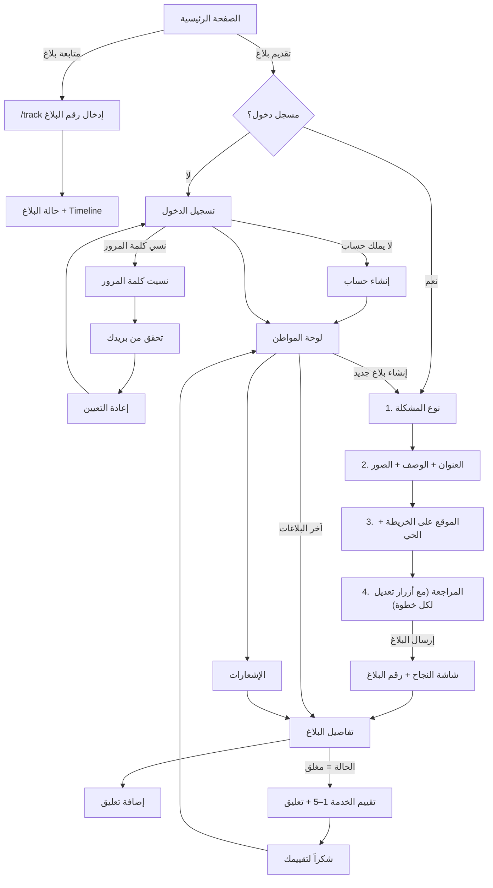
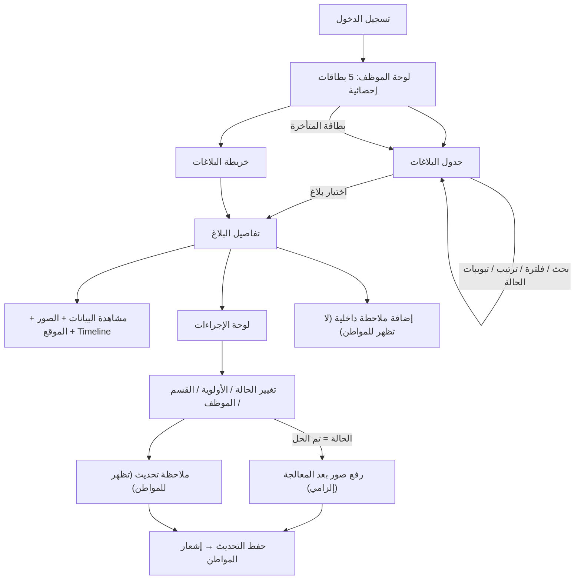
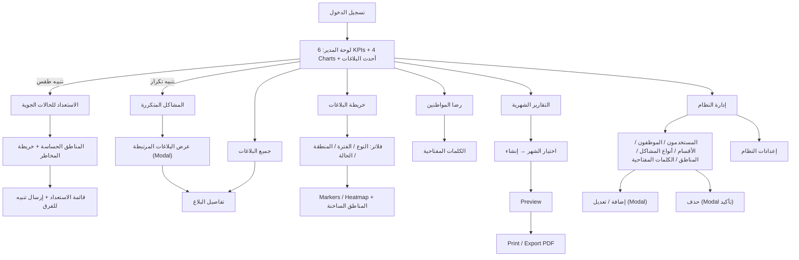
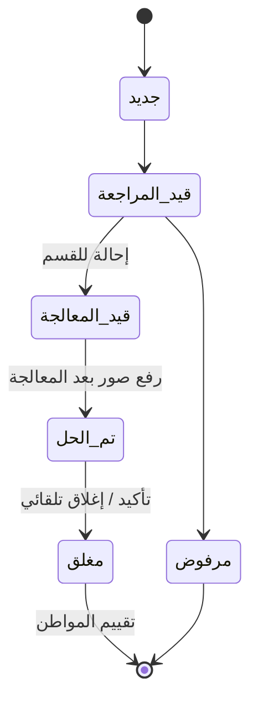

# 2. مسارات المستخدمين (User Flows)

## 2.1 المواطن

**نقاط تجربة الاستخدام الأساسية:**
- زر "بلاغ جديد" متاح دائماً: في الشريط العلوي (سطح المكتب) وزر دائري عائم في منتصف الشريط السفلي (موبايل).
- النموذج مقسّم لـ 4 خطوات قصيرة مع شريط تقدم، والتحقق من الحقول يظهر عند محاولة الانتقال فقط.
- زر "التالي" ثابت أسفل الشاشة على الموبايل لسهولة الوصول بالإبهام.
- المواطن لا يرى الملاحظات الداخلية للموظفين.

## 2.2 موظف البلدية

## 2.3 مدير البلدية (Admin)

## 2.4 دورة حياة البلاغ (الحالات)

"متأخر" ليست حالة مستقلة، بل **علامة (flag)** تظهر عندما يتجاوز البلاغ المدة المحددة (SLA) لنوع المشكلة وهو ما زال مفتوحاً.
