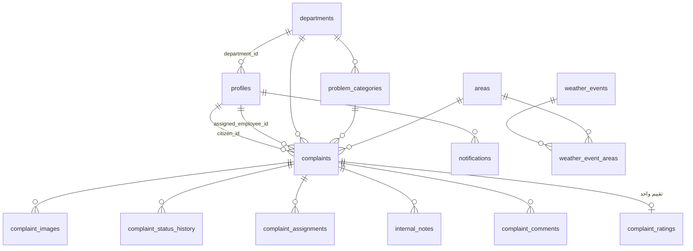

# 5. الـ Backend: قاعدة البيانات والأمان والتحليلات (Supabase)

Supabase هو الـ Backend الوحيد للمشروع. لا يوجد أي خادم آخر (Node.js أو Express أو غيره). التحليلات في هذا الفصل كلها SQL بدون ذكاء اصطناعي، وطبقة الذكاء الاصطناعي الاختيارية (Edge Function داخل Supabase) موثقة في [07-ai-layer.md](07-ai-layer.md).

| الخدمة | الاستخدام |
|---|---|
| Supabase Auth | التسجيل، الدخول، الخروج، استعادة كلمة المرور، الجلسات |
| PostgreSQL | الجداول + الدوال (RPC) + المشغلات (Triggers) + التحليلات |
| Row Level Security | حماية كل صف في كل جدول حسب المستخدم ودوره |
| Storage | صور البلاغات في Bucket خاص (`complaint-images`) |
| Realtime | وصول الإشعارات لحظياً |

الملفات: `supabase/migrations/20260928000000_init.sql` ثم `supabase/migrations/20260929000000_testing_fixes.sql`

---

## 5.1 الجداول

| الجدول | الوصف |
|---|---|
| `profiles` | بيانات المستخدم ودوره (`citizen`/`employee`/`admin`) وقسمه، ويُنشأ تلقائياً عند التسجيل |
| `departments` | الأقسام |
| `problem_categories` | أنواع المشاكل: القسم المسؤول، مدة المعالجة (SLA)، الأولوية الافتراضية، الأيقونة واللون، وهل النوع مرتبط بالطقس |
| `areas` | المناطق مع الإحداثيات ومستوى خطورة الفيضانات |
| `complaints` | البلاغات: رقم فريد `BLD-2026-000001`، الحالة، الأولوية، الموقع، الموعد النهائي `due_at` |
| `complaint_images` | مسارات الصور في Storage، ونوعها `citizen` / `before` / `after` |
| `complaint_status_history` | كل تغيير حالة: القديمة والجديدة، ومن غيّرها، والملاحظة، والوقت |
| `complaint_assignments` | سجل التحويل للأقسام والإسناد للموظفين (مع وقت إلغاء الإسناد) |
| `internal_notes` | ملاحظات داخلية للموظفين والمدير فقط |
| `complaint_comments` | المحادثة بين المواطن والبلدية |
| `complaint_ratings` | تقييم 1–5 وتعليق، والقيد `UNIQUE(complaint_id)` يمنع التقييم أكثر من مرة |
| `notifications` | إشعارات المستخدمين |
| `feedback_keywords` | الكلمات المفتاحية لتحليل التعليقات (إيجابية/سلبية/محايدة + المحور) |
| `weather_events`, `weather_event_areas` | الحالات الجوية والمناطق المتأثرة وقائمة الاستعداد |
| `app_settings` | إعدادات النظام (JSON) |

**الحالات:** `new → under_review → assigned → in_progress → resolved → closed`، أو `rejected`.
**الأولوية:** `low` / `medium` / `high` / `urgent`.

## 5.2 ما يحدث تلقائياً داخل قاعدة البيانات (Triggers)

| الحدث | ما يحدث |
|---|---|
| تسجيل مستخدم جديد | إنشاء `profiles` بدور **مواطن دائماً**، مهما أرسل المتصفح |
| إنشاء بلاغ | توليد رقم البلاغ، تحديد القسم من نوع المشكلة، الأولوية الافتراضية، الموعد النهائي (SLA)، أقرب منطقة إن لم تُحدد، ثم إنشاء أول سجل حالة وإشعار المواطن وموظفي القسم والمدير |
| تغيير الحالة | إنشاء سجل في `complaint_status_history` مع الملاحظة واسم الموظف، وتحديث `resolved_at`/`closed_at`/`updated_at`، وإرسال إشعار للمواطن |
| إسناد لموظف | تحويل الحالة إلى "تم التعيين"، وإنشاء سجل في `complaint_assignments`، وإشعار الموظف |
| تحويل لقسم آخر | إغلاق التعيين القديم، وإنشاء سجل جديد، وإشعار المواطن |
| تعليق جديد | إشعار الطرف الآخر (الموظف أو المواطن) |

كل تحديثات الموظف تمر عبر الدالة `update_complaint(...)` التي تمرر "ملاحظة التحديث" إلى سجل الحالات.

## 5.3 الأمان (RLS)

الحماية مطبقة في قاعدة البيانات نفسها وليس في JavaScript. أي محاولة من Console المتصفح تُرفض.

| الدور | الصلاحيات |
|---|---|
| **المواطن** | يرى ملفه وبلاغاته فقط. ينشئ بلاغات لنفسه، ويعلّق على بلاغاته المفتوحة، ويرفع صور `citizen` لبلاغاته. يرى إشعاراته فقط، ويقيّم بلاغه **المغلق** مرة واحدة. لا يرى الملاحظات الداخلية ولا سجل التعيينات إطلاقاً |
| **الموظف** | يرى بلاغات **قسمه** والبلاغات **المسندة إليه** فقط. يغيّر الحالة والأولوية، ويسند البلاغ لزملاء قسمه. يضيف ملاحظات داخلية وردوداً، ويرفع صور `before`/`after`. لا يستطيع: تحويل البلاغ لقسم آخر، تعديل نص المواطن، إعادة فتح بلاغ مغلق، تغيير دوره أو قسمه |
| **المدير** | إدارة كاملة، مع منع إزالة آخر مدير في النظام |

**حمايات إضافية:**
- **منع تصعيد الصلاحيات:** Trigger يمنع أي شخص غير المدير من تغيير `role` أو `department_id` أو `is_active`.
- **القيم الحساسة يحددها الخادم:** عند إنشاء البلاغ يتجاهل الخادم ما يرسله المتصفح من حالة ورقم وقسم وموظف مسند ومالك.
- **الحسابات الموقوفة** (`is_active = false`) تفقد الوصول فوراً حتى لو كانت جلستها سارية.
- **الإشعارات:** المستخدم يستطيع تعديل `is_read` فقط (صلاحية على مستوى العمود).
- **الحماية من الإغراق:** حد أقصى 10 بلاغات لكل مستخدم في الساعة، وحد لعدد الصور في كل بلاغ.
- **التخزين:** Bucket خاص بحجم أقصى 5MB وصور فقط. المسار `{complaint_id}/{kind}/{file}`، وسياسات Storage تتحقق من صاحب البلاغ ونوع الصورة. العرض عبر روابط موقّعة مؤقتة.
- **متابعة بلاغ بدون تسجيل دخول:** الدالة `track_complaint` تعيد بيانات محدودة فقط (الحالة، النوع، القسم، المنطقة، التواريخ) بدون وصف أو أسماء أو موقع دقيق.
- **الواجهة:** كل النصوص القادمة من قاعدة البيانات تُعرض بعد تهريبها (`esc()`) لمنع XSS، وملف CSV محمي من حقن الصيغ.

تم اختبار هذه القواعد آلياً بتسجيل الدخول بكل دور ومحاولة الوصول لبيانات غير مسموحة (129 اختباراً ناجحاً). الاختبارات شملت IDOR بين مواطنين، والملاحظات الداخلية، والتخزين (رفع/قراءة/حذف/قائمة الملفات)، وتصعيد الصلاحيات، والتعديل المباشر عبر REST، وتزوير التواريخ.

- **تواريخ الحل والإغلاق** (`resolved_at` / `closed_at`) يحددها الخادم فقط عند تغيير الحالة، ولا يمكن تعديلها مباشرة.

## 5.4 التحليلات (بدون ذكاء اصطناعي)

| الدالة | الوصف |
|---|---|
| `dashboard_stats()` | الأرقام الرئيسية، وتحترم RLS: كل دور يرى أرقام بياناته |
| `analytics_breakdown(from, to)` | البلاغات حسب النوع والقسم والمنطقة والحالة |
| `monthly_trend(months)` | المستلمة والمغلقة شهرياً |
| `hotspot_areas(days, category, status)` | **المناطق الساخنة:** العدد الكلي، وآخر 30 و90 و180 يوماً، والمفتوحة، والنوع الأكثر |
| `recurring_problems(radius, months, min)` | **المشاكل المتكررة** (انظر أدناه) |
| `weather_risk_areas(event)` | المناطق الحساسة للطقس حسب تاريخ بلاغات الفيضانات والتصريف |
| `satisfaction_summary(from, to)` | متوسط التقييم، توزيع النجوم، نسبة الرضا، الأقسام، الأشهر، تكرار الكلمات المفتاحية |
| `monthly_report(month)` | كل ما سبق لشهر محدد، والملخص النصي يُبنى بقوالب JavaScript |

**خوارزمية المشاكل المتكررة:** تعتبر مجموعة البلاغات مشكلة متكررة إذا تحققت الشروط الأربعة معاً:
1. **نفس نوع المشكلة.**
2. **مسافة لا تتجاوز R متر** بين البلاغات، وتُحسب بمعادلة Haversine بدون الحاجة إلى PostGIS.
3. **خلال آخر M شهر.**
4. **عدد البلاغات ≥ N.**

القيم الافتراضية 200 متر و6 أشهر و3 بلاغات، وتُعدّل من الإعدادات.

طريقة الحساب: يُحسب لكل بلاغ عدد جيرانه المطابقين، ثم تُختار المراكز الأكثر كثافة أولاً (Greedy)، ويُستبعد ما دخل في مجموعة سابقة حتى لا تتكرر المجموعات. بعدها تُعطى كل مجموعة درجة خطورة وتوصية بقواعد ثابتة، مثل "≥ 6 بلاغات → تحتاج صيانة جذرية".

**تحليل الرضا:** مطابقة نصية للكلمات المفتاحية التي يديرها المدير داخل تعليقات التقييم. تُحسب أكثر الكلمات السلبية تكراراً كـ "أسباب عدم الرضا".
